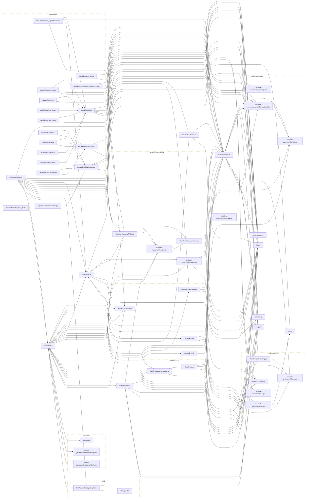

## Capabilities modules and org dependencies

```mermaid
flowchart LR

	capabilities/chain_capabilities/evm --> capabilities/libs
	capabilities/chain_capabilities/evm --> chainlink-common/pkg/chipingress
	capabilities/chain_capabilities/evm --> chainlink-common/pkg/workflows/sdk/v2/pb
	capabilities/chain_capabilities/evm --> chainlink-evm
	capabilities/chain_capabilities/evm --> chainlink-framework/chains
	click capabilities/chain_capabilities/evm href "https://github.com/smartcontractkit/capabilities"
	capabilities/consensus --> capabilities/libs
	capabilities/consensus --> chainlink-common/pkg/chipingress
	capabilities/consensus --> chainlink-common/pkg/workflows/sdk/v2/pb
	click capabilities/consensus href "https://github.com/smartcontractkit/capabilities"
	capabilities/cron --> capabilities/libs
	capabilities/cron --> chainlink-common/pkg/workflows/sdk/v2/pb
	click capabilities/cron href "https://github.com/smartcontractkit/capabilities"
	capabilities/devenv --> chain-selectors
	capabilities/devenv --> chainlink-automation
	capabilities/devenv --> chainlink-data-streams
	capabilities/devenv --> chainlink-evm
	capabilities/devenv --> chainlink-framework/chains
	capabilities/devenv --> chainlink-framework/metrics
	capabilities/devenv --> chainlink-framework/multinode
	capabilities/devenv --> chainlink-protos/svr
	capabilities/devenv --> chainlink-protos/workflows/go
	capabilities/devenv --> chainlink-tron/relayer
	capabilities/devenv --> chainlink/v2
	capabilities/devenv --> tdh2/go/ocr2/decryptionplugin
	capabilities/devenv --> wsrpc
	click capabilities/devenv href "https://github.com/smartcontractkit/capabilities"
	capabilities/http_action --> capabilities/libs
	click capabilities/http_action href "https://github.com/smartcontractkit/capabilities"
	capabilities/http_trigger --> capabilities/libs
	capabilities/http_trigger --> chainlink-common/pkg/workflows/sdk/v2/pb
	click capabilities/http_trigger href "https://github.com/smartcontractkit/capabilities"
	capabilities/integration_tests --> capabilities/loadtestwritetarget
	capabilities/integration_tests --> chainlink/v2
	click capabilities/integration_tests href "https://github.com/smartcontractkit/capabilities"
	capabilities/kvstore --> capabilities/libs/loopserver
	capabilities/kvstore --> capabilities/libs/testutils
	click capabilities/kvstore href "https://github.com/smartcontractkit/capabilities"
	capabilities/libs --> chainlink-common
	capabilities/libs --> chainlink-common/pkg/values
	capabilities/libs --> freeport
	capabilities/libs --> grpc-proxy
	capabilities/libs --> libocr
	click capabilities/libs href "https://github.com/smartcontractkit/capabilities"
	capabilities/libs/loopserver --> chainlink-common
	capabilities/libs/loopserver --> grpc-proxy
	capabilities/libs/loopserver --> libocr
	click capabilities/libs/loopserver href "https://github.com/smartcontractkit/capabilities"
	capabilities/libs/testutils --> chainlink-common
	capabilities/libs/testutils --> libocr
	click capabilities/libs/testutils href "https://github.com/smartcontractkit/capabilities"
	capabilities/loadtestwritetarget --> capabilities/libs/loopserver
	click capabilities/loadtestwritetarget href "https://github.com/smartcontractkit/capabilities"
	capabilities/mock --> capabilities/libs/loopserver
	capabilities/mock --> capabilities/libs/testutils
	click capabilities/mock href "https://github.com/smartcontractkit/capabilities"
	capabilities/p2psigner --> capabilities/libs
	click capabilities/p2psigner href "https://github.com/smartcontractkit/capabilities"
	capabilities/readcontract --> capabilities/libs
	click capabilities/readcontract href "https://github.com/smartcontractkit/capabilities"
	capabilities/workflowevent --> capabilities/libs/loopserver
	capabilities/workflowevent --> capabilities/libs/testutils
	click capabilities/workflowevent href "https://github.com/smartcontractkit/capabilities"
	capabilities/workflows --> chainlink-common
	capabilities/workflows --> libocr
	click capabilities/workflows href "https://github.com/smartcontractkit/capabilities"
	capabilities/workflows/readbalancesgen --> chainlink-common
	capabilities/workflows/readbalancesgen --> libocr
	click capabilities/workflows/readbalancesgen href "https://github.com/smartcontractkit/capabilities"
	chain-selectors
	click chain-selectors href "https://github.com/smartcontractkit/chain-selectors"
	chainlink-aptos --> chainlink-common
	chainlink-aptos --> freeport
	chainlink-aptos --> grpc-proxy
	chainlink-aptos --> libocr
	click chainlink-aptos href "https://github.com/smartcontractkit/chainlink-aptos"
	chainlink-automation --> chainlink-common
	chainlink-automation --> libocr
	click chainlink-automation href "https://github.com/smartcontractkit/chainlink-automation"
	chainlink-ccip --> chain-selectors
	chainlink-ccip --> chainlink-common
	chainlink-ccip --> chainlink-protos/rmn/v1.6/go
	chainlink-ccip --> libocr
	click chainlink-ccip href "https://github.com/smartcontractkit/chainlink-ccip"
	chainlink-ccip/chains/solana --> chainlink-ccip
	chainlink-ccip/chains/solana --> chainlink-common
	chainlink-ccip/chains/solana --> libocr
	click chainlink-ccip/chains/solana href "https://github.com/smartcontractkit/chainlink-ccip"
	chainlink-common --> chain-selectors
	chainlink-common --> chainlink-common/pkg/chipingress
	chainlink-common --> chainlink-common/pkg/workflows/sdk/v2/pb
	chainlink-common --> chainlink-protos/billing/go
	chainlink-common --> chainlink-protos/workflows/go
	chainlink-common --> freeport
	chainlink-common --> grpc-proxy
	chainlink-common --> libocr
	click chainlink-common href "https://github.com/smartcontractkit/chainlink-common"
	chainlink-common/pkg/chipingress
	click chainlink-common/pkg/chipingress href "https://github.com/smartcontractkit/chainlink-common"
	chainlink-common/pkg/monitoring
	click chainlink-common/pkg/monitoring href "https://github.com/smartcontractkit/chainlink-common"
	chainlink-common/pkg/values
	click chainlink-common/pkg/values href "https://github.com/smartcontractkit/chainlink-common"
	chainlink-common/pkg/workflows/sdk/v2/pb --> chainlink-common/pkg/values
	click chainlink-common/pkg/workflows/sdk/v2/pb href "https://github.com/smartcontractkit/chainlink-common"
	chainlink-data-streams --> chainlink-common
	chainlink-data-streams --> grpc-proxy
	chainlink-data-streams --> libocr
	click chainlink-data-streams href "https://github.com/smartcontractkit/chainlink-data-streams"
	chainlink-evm --> chain-selectors
	chainlink-evm --> chainlink-framework/capabilities
	chainlink-evm --> chainlink-framework/chains
	chainlink-evm --> chainlink-protos/svr
	chainlink-evm --> chainlink-tron/relayer
	chainlink-evm --> grpc-proxy
	click chainlink-evm href "https://github.com/smartcontractkit/chainlink-evm"
	chainlink-feeds --> chainlink-common
	click chainlink-feeds href "https://github.com/smartcontractkit/chainlink-feeds"
	chainlink-framework/capabilities --> chainlink-common
	chainlink-framework/capabilities --> libocr
	click chainlink-framework/capabilities href "https://github.com/smartcontractkit/chainlink-framework"
	chainlink-framework/chains --> chainlink-framework/multinode
	chainlink-framework/chains --> freeport
	click chainlink-framework/chains href "https://github.com/smartcontractkit/chainlink-framework"
	chainlink-framework/metrics --> chainlink-common
	chainlink-framework/metrics --> libocr
	click chainlink-framework/metrics href "https://github.com/smartcontractkit/chainlink-framework"
	chainlink-framework/multinode --> chainlink-common
	chainlink-framework/multinode --> chainlink-framework/metrics
	chainlink-framework/multinode --> libocr
	click chainlink-framework/multinode href "https://github.com/smartcontractkit/chainlink-framework"
	chainlink-protos/billing/go --> chainlink-protos/workflows/go
	click chainlink-protos/billing/go href "https://github.com/smartcontractkit/chainlink-protos"
	chainlink-protos/orchestrator --> wsrpc
	click chainlink-protos/orchestrator href "https://github.com/smartcontractkit/chainlink-protos"
	chainlink-protos/rmn/v1.6/go
	click chainlink-protos/rmn/v1.6/go href "https://github.com/smartcontractkit/chainlink-protos"
	chainlink-protos/svr
	click chainlink-protos/svr href "https://github.com/smartcontractkit/chainlink-protos"
	chainlink-protos/workflows/go
	click chainlink-protos/workflows/go href "https://github.com/smartcontractkit/chainlink-protos"
	chainlink-solana --> chainlink-ccip/chains/solana
	chainlink-solana --> chainlink-common/pkg/monitoring
	chainlink-solana --> chainlink-common/pkg/values
	chainlink-solana --> chainlink-framework/multinode
	chainlink-solana --> freeport
	chainlink-solana --> grpc-proxy
	click chainlink-solana href "https://github.com/smartcontractkit/chainlink-solana"
	chainlink-tron/relayer --> chainlink-evm
	click chainlink-tron/relayer href "https://github.com/smartcontractkit/chainlink-tron"
	chainlink/v2 --> chain-selectors
	chainlink/v2 --> chainlink-aptos
	chainlink/v2 --> chainlink-automation
	chainlink/v2 --> chainlink-ccip/chains/solana
	chainlink/v2 --> chainlink-common/pkg/values
	chainlink/v2 --> chainlink-common/pkg/workflows/sdk/v2/pb
	chainlink/v2 --> chainlink-data-streams
	chainlink/v2 --> chainlink-evm
	chainlink/v2 --> chainlink-feeds
	chainlink/v2 --> chainlink-framework/capabilities
	chainlink/v2 --> chainlink-framework/chains
	chainlink/v2 --> chainlink-framework/multinode
	chainlink/v2 --> chainlink-protos/billing/go
	chainlink/v2 --> chainlink-protos/orchestrator
	chainlink/v2 --> chainlink-protos/rmn/v1.6/go
	chainlink/v2 --> chainlink-protos/svr
	chainlink/v2 --> chainlink-protos/workflows/go
	chainlink/v2 --> chainlink-solana
	chainlink/v2 --> chainlink-tron/relayer
	chainlink/v2 --> cre-sdk-go
	chainlink/v2 --> cre-sdk-go/capabilities/networking/http
	chainlink/v2 --> cre-sdk-go/capabilities/scheduler/cron
	chainlink/v2 --> tdh2/go/ocr2/decryptionplugin
	click chainlink/v2 href "https://github.com/smartcontractkit/chainlink"
	cre-sdk-go
	click cre-sdk-go href "https://github.com/smartcontractkit/cre-sdk-go"
	cre-sdk-go/capabilities/networking/http
	click cre-sdk-go/capabilities/networking/http href "https://github.com/smartcontractkit/cre-sdk-go"
	cre-sdk-go/capabilities/scheduler/cron
	click cre-sdk-go/capabilities/scheduler/cron href "https://github.com/smartcontractkit/cre-sdk-go"
	freeport
	click freeport href "https://github.com/smartcontractkit/freeport"
	grpc-proxy
	click grpc-proxy href "https://github.com/smartcontractkit/grpc-proxy"
	libocr
	click libocr href "https://github.com/smartcontractkit/libocr"
	tdh2/go/ocr2/decryptionplugin --> libocr
	tdh2/go/ocr2/decryptionplugin --> tdh2/go/tdh2
	click tdh2/go/ocr2/decryptionplugin href "https://github.com/smartcontractkit/tdh2"
	tdh2/go/tdh2
	click tdh2/go/tdh2 href "https://github.com/smartcontractkit/tdh2"
	wsrpc
	click wsrpc href "https://github.com/smartcontractkit/wsrpc"

	subgraph capabilities-repo[capabilities]
		 capabilities/chain_capabilities/evm
		 capabilities/consensus
		 capabilities/cron
		 capabilities/devenv
		 capabilities/http_action
		 capabilities/http_trigger
		 capabilities/integration_tests
		 capabilities/kvstore
		 capabilities/libs
		 capabilities/libs/loopserver
		 capabilities/libs/testutils
		 capabilities/loadtestwritetarget
		 capabilities/mock
		 capabilities/p2psigner
		 capabilities/readcontract
		 capabilities/workflowevent
		 capabilities/workflows
		 capabilities/workflows/readbalancesgen
	end
	click capabilities-repo href "https://github.com/smartcontractkit/capabilities"

	subgraph chainlink-ccip-repo[chainlink-ccip]
		 chainlink-ccip
		 chainlink-ccip/chains/solana
	end
	click chainlink-ccip-repo href "https://github.com/smartcontractkit/chainlink-ccip"

	subgraph chainlink-common-repo[chainlink-common]
		 chainlink-common
		 chainlink-common/pkg/chipingress
		 chainlink-common/pkg/monitoring
		 chainlink-common/pkg/values
		 chainlink-common/pkg/workflows/sdk/v2/pb
	end
	click chainlink-common-repo href "https://github.com/smartcontractkit/chainlink-common"

	subgraph chainlink-framework-repo[chainlink-framework]
		 chainlink-framework/capabilities
		 chainlink-framework/chains
		 chainlink-framework/metrics
		 chainlink-framework/multinode
	end
	click chainlink-framework-repo href "https://github.com/smartcontractkit/chainlink-framework"

	subgraph chainlink-protos-repo[chainlink-protos]
		 chainlink-protos/billing/go
		 chainlink-protos/orchestrator
		 chainlink-protos/rmn/v1.6/go
		 chainlink-protos/svr
		 chainlink-protos/workflows/go
	end
	click chainlink-protos-repo href "https://github.com/smartcontractkit/chainlink-protos"

	subgraph cre-sdk-go-repo[cre-sdk-go]
		 cre-sdk-go
		 cre-sdk-go/capabilities/networking/http
		 cre-sdk-go/capabilities/scheduler/cron
	end
	click cre-sdk-go-repo href "https://github.com/smartcontractkit/cre-sdk-go"

	subgraph tdh2-repo[tdh2]
		 tdh2/go/ocr2/decryptionplugin
		 tdh2/go/tdh2
	end
	click tdh2-repo href "https://github.com/smartcontractkit/tdh2"

	classDef outline stroke-dasharray:6,fill:none;
	class capabilities-repo,chainlink-ccip-repo,chainlink-common-repo,chainlink-framework-repo,chainlink-protos-repo,cre-sdk-go-repo,tdh2-repo outline
```
