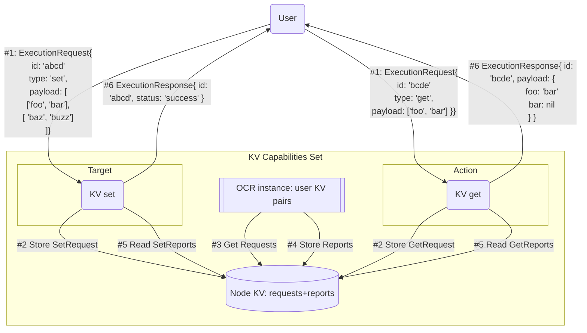

# KV Store Capabilities Set

Enables workflow authors to store and retrieve arbitrary key value pairs from a workflow.



## TODOs

- [ ] Hardcode oracle config - allow a single node.
- [ ] Implement config tracker to use capabilities registry.
- [ ] Process incoming Target execution requests
  - [ ] Store messages in the inbox

## Plan

Inputs: Report

```go
type MetadataV1 struct {
    Version             uint8
	WorkflowExecutionID [32]byte
	Timestamp           uint32
	DonID               uint32
	DonConfigVersion    uint32
	WorkflowCID         [32]byte
	WorkflowName        [10]byte
	WorkflowOwner       [20]byte
	ReportID            [2]byte
}

type Report struct {
    // Payload prepends MetadataV1 struct.
	Report []byte
	// Report context is appended to the payload before signing by libOCR.
	// It contains config digest + round/epoch/sequence numbers (currently 96 bytes).
	// Has to be appended to the report before validating signatures.
	Context []byte
	// Always exactly F+1 signatures.
	Signatures [][]byte
	// Report ID defined in the workflow spec (2 bytes).
	ID []byte
}
```

Report needs to have at least one `KVPair` JSON-encoded in the payload. Empty

```go
type KVPair struct {
    Key   string `json:"key"`
    Value string `json:"value"`
}
```

Consensus capability:

- Encoder:
  - type: "JSON"
  <!-- - schema: ??? -->

Write KV Store inputs:

- Key: decode
- Value: decode

Write
=> Node's Write Inbox
=> OCR observation for writes
=> Append to previous outcome

1. PreviousOutcome: { key1: foo, key2: bar }
2. New write comes in with { key3: baz } // This would set.
3. NewOutcome: { key1: foo, key2: bar, key3: baz }

Read
=> Node's Read Inbox (check outbox before OCR observation)
=> OCR observation for reads
=> All Node's Read Outbox/Callback for WorkflowExecutionID (cached for some time).

- Q: Consensus on the read?

KV Store read:
Keys is a runtime input.
Capability verifies sigs and extracts payloads. Output: []byte or [][]byte
