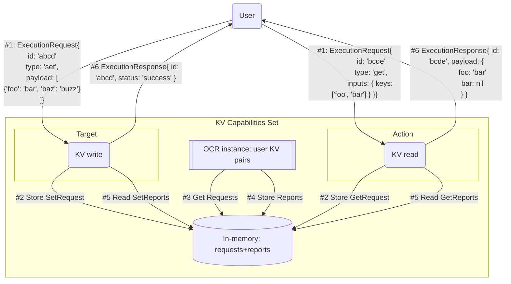

# KV Store Capabilities Set

Enables workflow authors to store and retrieve arbitrary key value pairs from a workflow.

```mermaid
flowchart TB
	user(User)
	subgraph KV Capabilities Set
		subgraph Action
			action(KV read)
		end
		subgraph Target
			target(KV write)
		end
		requests[(In-memory: requests+reports)]
		oracle[[OCR instance: user KV pairs]]
	end

	user--"#1: ExecutionRequest{
		id: 'abcd'
		type: 'set',
		payload: [
			{'foo': 'bar', 'baz': 'buzz'}
		]}"-->target
	user--"#1: ExecutionRequest{
		id: 'bcde'
		type: 'get',
		inputs: { keys: ['foo', 'bar'] } }}"-->action

	target--"#2 Store SetRequest"-->requests
	target--"#5 Read SetReports"-->requests
	target--"#6 ExecutionResponse{ id: 'abcd', status: 'success' }"-->user

	oracle--"#3 Get Requests"-->requests
	oracle--"#4 Store Reports"-->requests

	action--"#2 Store GetRequest"-->requests
	action--"#5 Read GetReports"-->requests
	action--"#6 ExecutionResponse{ id: 'bcde', payload: {
		foo: 'bar'
		bar: nil
	} }"-->user
```
