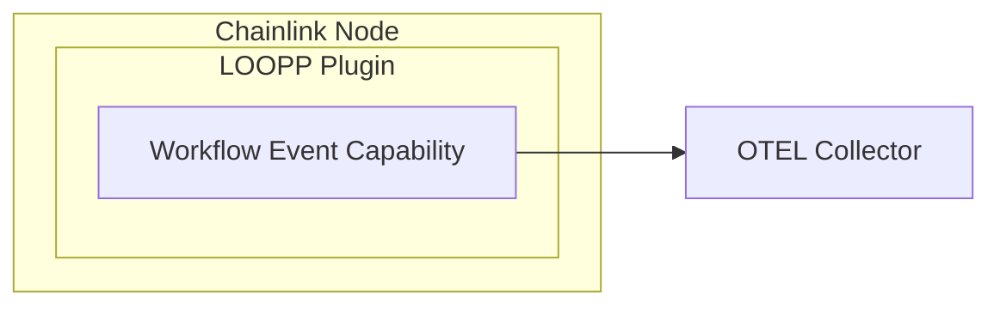

# Workflow event target

This is a target that, when executed, emits events via a telemetry client



## Development

### Tidy

`nx run tidy`

### Generate

`nx run generate`

### Test

`nx run test`


## Configuration

The capability accepts the following configuration:
- `otelEndpoint`: The endpoint of the OTEL collector to send the events to, defaults to `http://localhost:4317` if not specified

## Usage

The capability accepts a `Payload` input, which is a map of key-value pairs that will be sent as part of the event. 
The events are emitted to the OTEL collector using beholder.

### In toml workflows

```yaml
targets:
 - id: 'workflowevent-target@1.0.0'
   config:
    otelEndpoint: 'http://localhost:4317'
   inputs:
     payload:
       test: '$(trigger.outputs)'
       test2: 'dummy input
```

### In go workflows

```go
import "github.com/smartcontractkit/capabilities/workflowevent/workfloweventcap"
````

```go
workfloweventcap.Config{}.New(w, workfloweventcap.TargetInput{
		Payload: sdk.AnyMap[workfloweventcap.PayloadPayload](sdk.CapMap{
			"test":  sdk.ConstantDefinition(eventId.String()),
			"test2": "hello",
		}),
	})
```

