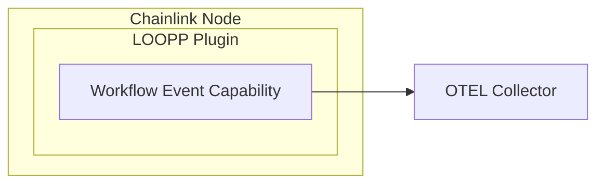

# Workflow event target

This is a target that, when executed, emits events via a telemetry client

## Development

### Tidy

`nx run tidy`

### Generate

`nx run generate`

### Test

`nx run test`

